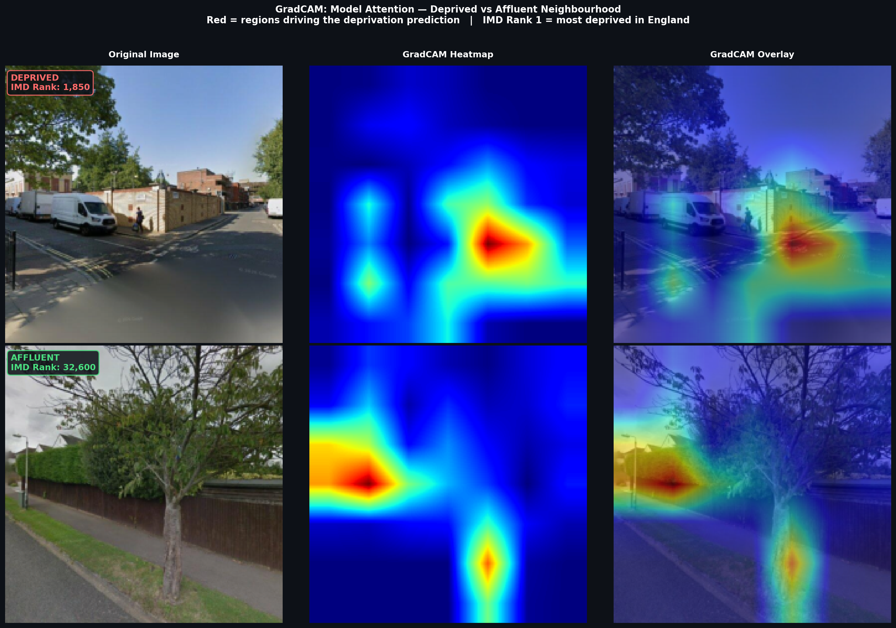
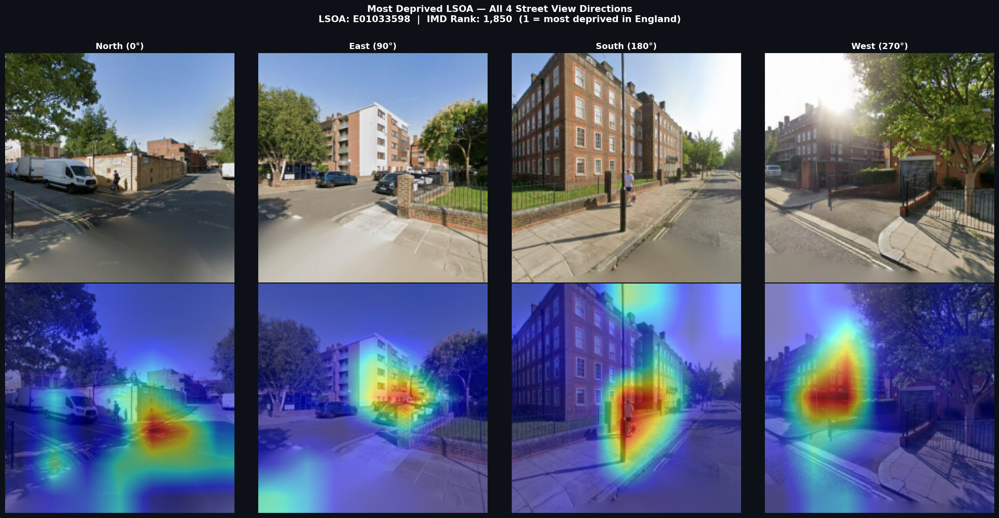
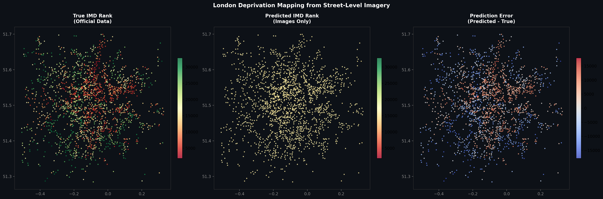
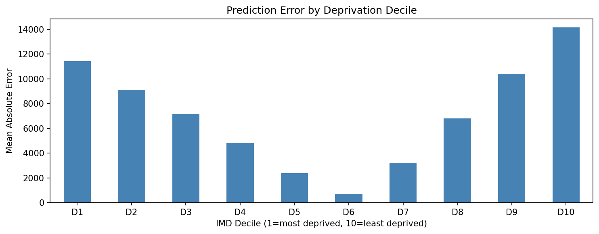
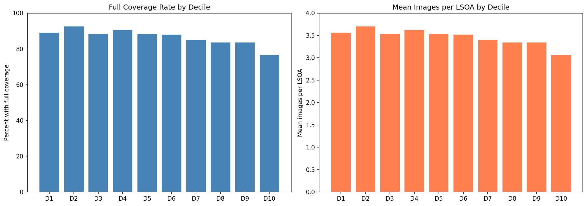

# Urban Inequality Fingerprints
### Predicting Neighbourhood Deprivation from Street-Level Imagery using Computer Vision

## Overview
This project uses frozen ResNet-50 and EfficientNet-B2 convolutional neural networks combined with PCA dimensionality reduction and Ridge Regression to predict neighbourhood deprivation rankings from Google Street View and aerial imagery across London. It combines computer vision, geospatial analysis, and explainable AI to identify visual markers of socioeconomic inequality at street level.

The model is evaluated using **spatial cross-validation (borough holdout)** — a rigorous evaluation strategy that tests generalisation to entirely unseen geographies, not just unseen images from the same area.

**R² = 0.27** on spatial holdout cross-validation (images only).

## Key Results
- **R² = 0.27** (0.2682) on borough holdout spatial cross-validation (images only)
- **6,924 Street View images** across 2,000 London LSOAs spanning all deprivation deciles
- **GradCAM** reveals the model attends to large uniform brick facades consistent with high-density residential blocks, parked commercial vehicles, and open road surfaces — not sky or vegetation as originally hypothesised
- **U-shaped error curve** — the model performs best in mid-range deciles and worst at the extremes, with direct implications for where visual deprivation monitoring can and cannot be trusted
- **Coverage bias analysis** — affluent areas have slightly lower Street View coverage than deprived areas, ruling out coverage bias as an explanation for model performance patterns
- Fine-tuning ResNet-50 performed worse than the frozen model (R² ≈ 0.18 vs 0.27), confirming the dataset is too small for end-to-end training with 23 million parameters

## A Note on Methodology
An earlier version of this project reported R² = 0.942 using a fine-tuned ResNet-18 evaluated on a random validation split. This was identified as an artefact of spatial autocorrelation: LSOAs from the same borough appeared in both training and validation sets, inflating results through geographic proximity rather than genuine visual learning. The current methodology addresses this entirely with borough holdout spatial CV. The drop from 0.942 to 0.27 is not a failure — it is the result of asking a more honest question.

## Visual Outputs
### GradCAM: Deprived vs Affluent

### GradCAM: 4 Directions (Most Deprived LSOA)

### London Deprivation Map

### Error by Deprivation Decile

### Street View Coverage Bias

## Tech Stack
- **Python** — PyTorch, GeoPandas, Scikit-learn, Matplotlib
- **Computer Vision** — ResNet-50 + EfficientNet-B2 pretrained on ImageNet (frozen)
- **Feature Extraction** — PCA (100 components), StandardScaler, Ridge Regression
- **Explainability** — Custom GradCAM (gradient hooks on ResNet layer4)
- **Geospatial** — GeoPandas, Folium, OpenStreetMap tiles
- **Evaluation** — Borough holdout spatial cross-validation (5 folds, 51 London boroughs)

## Data Sources
- [Index of Multiple Deprivation 2019](https://www.gov.uk/government/statistics/english-indices-of-deprivation-2019) — UK Government (File 2: ranks, File 7: sub-domain scores)
- [LSOA Boundaries](https://geoportal.statistics.gov.uk) — Office for National Statistics
- Google Street View Static API
- OpenStreetMap tile server (aerial imagery)

## How It Works
1. Sample 2,000 London LSOAs stratified across 10 deprivation deciles (200 per decile)
2. Download 4 Street View images per LSOA (N/S/E/W headings) via Google API and OSM aerial tiles
3. Extract 2,048-d embeddings using frozen ResNet-50 (street view) and 1,408-d using frozen EfficientNet-B2 (aerial)
4. Concatenate embeddings into a 3,456-d fused feature vector per LSOA
5. Reduce dimensions with PCA (100 components) and fit Ridge Regression
6. Evaluate using borough holdout spatial cross-validation across 5 folds
7. Apply GradCAM to visualise model attention across deprived and affluent areas
8. Analyse error distribution across deprivation deciles and Street View coverage bias

## How to Run
1. Clone this repository
2. Install dependencies: `pip install -r requirements.txt`
3. Copy `src/api_keys_template.py` to `src/api_keys.py` and add your Google API key
4. Run notebooks in order: `notebook1` → `notebook2` → `notebook2b` → `notebook3_main` → `notebook4` → `notebook4_gradcam` → `notebook5`
5. GPU recommended for notebook3_main and notebook4_gradcam (Google Colab T4 works well)

## Notebooks

| Notebook | Description |
|---|---|
| `notebook1` | IMD data loading, London LSOA sampling |
| `notebook2` | Google Street View image download |
| `notebook2b` | OSM aerial tile download |
| `notebook3_main` | **Main model**: spatial CV, PCA, Ridge regression — headline R² = 0.2682 lives here |
| `notebook3_fusion_tabular` | Ablation: tabular IMD sub-domain scores vs images |
| `notebook3_fusion_baseline` | Fusion baseline with random KFold (pre-spatial CV) |
| `notebook3_finetune` | Fine-tuning attempt (documented failure, R² ≈ 0.18) |
| `notebook4` | Street View coverage bias analysis |
| `notebook4_gradcam` | GradCAM visualisations |
| `notebook5` | London deprivation map, error analysis. Note: the R² printed in this notebook (0.0208) uses images-only coefficients extracted from a fused model and is not the headline result — see notebook3_main for the correct spatial CV evaluation |
| `notebook5_folium_map` | Interactive Folium choropleth map |

## Limitations
- R² = 0.27 means 73% of variance is unexplained by visual features alone; not a deployment-ready tool
- Analysis limited to London; generalisability to other UK cities or international contexts is untested
- No census demographic baseline; cannot determine whether imagery adds signal beyond basic housing type data
- Stratified sampling (200 LSOAs per decile) creates an artificial uniform distribution that does not reflect the real prevalence of deprivation deciles across London — results on a naturally distributed dataset may differ
- Spearman rank correlation would be a more appropriate metric given the ordinal nature of IMD ranks; R² assumes equal intervals between values which may not hold for deprivation rankings — left for future work
- The U-shaped error curve means the model is least reliable at the extremes of the deprivation spectrum, precisely where policy attention is most concentrated

## Author
Sarah Hong — Information Management for Business BSc, First Year, UCL (2026)
